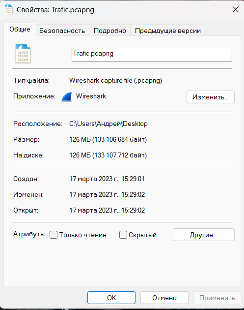

# Сбор и аналитическая обработка информации о сетевом трафике

## Цель работы

1.Развить практические навыки использования современного стека инструментов сбора и аналитической обработки информации о сетвом трафике

2.Освоить базовые подходы блокировки нежелательного сетевого трафика

3.Закрепить знания о современных сетевых протоколах прикладного уровня

## Ход работы

1.C помощью Wireshark был собран сетевой трафик объёмом 126 Мб:



2.C помощью утилиты Zeek была выделена метаинформация сетевого трафика (dns.log, http.log)

3.Загрузим и соединим файлы, содержащие списки источников нежелательного трафика:

```bash
mkdir hosts
cd hosts
wget -q https://github.com/StevenBlack/hosts/raw/master/data/add.2o7Net/hosts
wget -q https://raw.githubusercontent.com/StevenBlack/hosts/master/data/KADhosts/hosts
wget -q https://raw.githubusercontent.com/StevenBlack/hosts/master/data/yoyo.org/hosts
wget -q https://raw.githubusercontent.com/StevenBlack/hosts/master/data/tiuxo/hosts
wget -q https://raw.githubusercontent.com/StevenBlack/hosts/master/data/URLHaus/hosts
sort hosts* | grep "^[^#;]" | uniq > final_hosts
mv final_hosts ../Fhosts.data
cd ..
rm -rf hosts
```

В результате получен файл Fhosts.data.

4.Установим библиотеку Zeek Analysis Toolkit для преобразоваия метаинформации сетевого трафика в формате log-файлов в датафрейм Pandas:

```bash
pip -q install zat
```

5.После установки библиотеки преобразуем файл dns.log в датафрейм Pandas:

```bash
import warnings
warnings.filterwarnings("ignore", category=RuntimeWarning)
import numpy as np
import pandas as pd
from zat.log_to_dataframe import LogToDataFrame
df = LogToDataFrame()
z_df = df.create_dataframe('dns.log')
domains = z_df['query']
domains.name = 'CNAME'

```

6.Затем преобразуем файл со списком источников нежелательного трафика:

```bash
df = pd.read_csv('Fhosts.data', sep="\s+", names=['redirect_to','CNAME'])
bd_domains = df['CNAME']

```

7.Объединим два полученных датафрейма и получим процент нежелательного трафика:

```bash
merged = pd.merge(domains, bd_domains, on='CNAME', how='left', indicator='exists')
merged['exists'] = np.where(merged.exists == 'both', True,False)
count = merged['exists'].value_counts()[1]
percentile = round(merged['exists'].value_counts(normalize=True)[1]*100, 2)
print("DNS имен из списков трафика: {}.".format(count), "Процент нежелательного трафика: {}%.".format(percentile), sep='\n')

```


## Оценка результата

В результате лабораторной работы мы смлогли определить нежедательный трафик.

## Вывод

Таким образом. мы научились, анализировать сетевой трафик.
