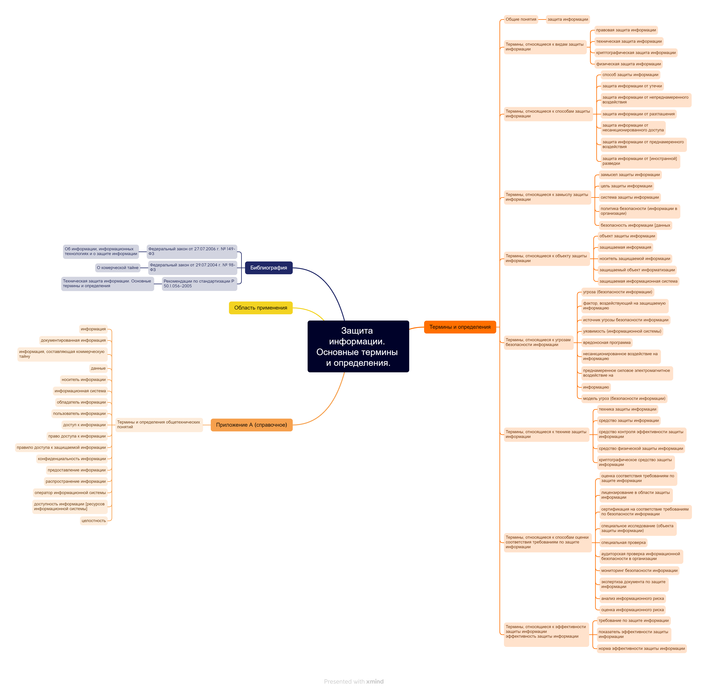

# Практическая работа № 5

1. Для построения mind-карты был взят ГОСТ Р 50922-2006. Защита информации. Основные термины и определения.

 Ссылка на документ - https://docs.cntd.ru/document/1200058320

2. Была использована программа Xmind

3. Результат

